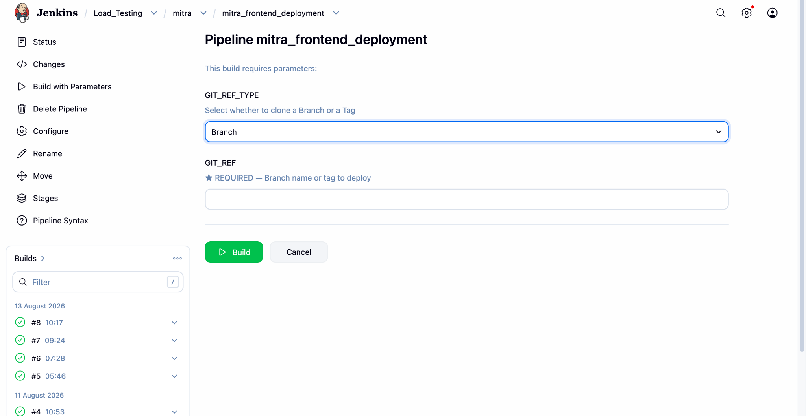
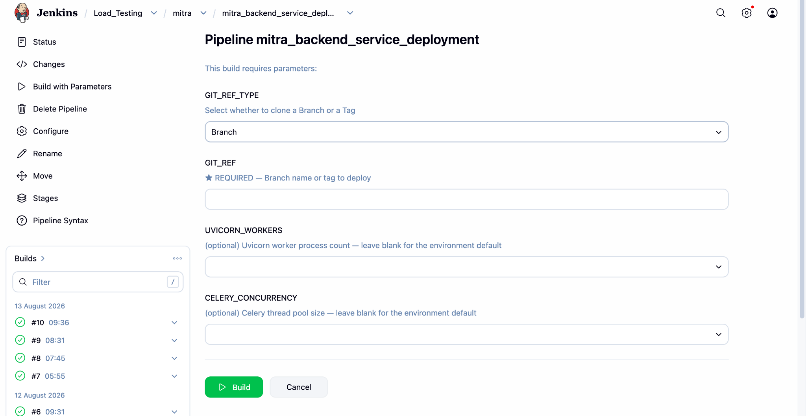

# Mitra Load Test Environment -- Jenkins & Vault Guide

## 1. Purpose

This guide explains how to access and use the **Vault** and **Jenkins
deployment jobs** for the Mitra load-test environment.

It is written for team members who are using the deployment setup for
the first time.

> **Important:** Do not share your Jenkins or Vault credentials with
> anyone. Never commit Vault secrets, tokens, passwords, or other
> sensitive values to Git repositories or documentation.

------------------------------------------------------------------------

## 2. Prerequisites

Before starting, make sure you have the following:

### 2.1 VPN access

You must have VPN access to the network where the Jenkins and Vault
servers are hosted.

Confirm that you have the required VPN profile and that the VPN
connection is active.

### 2.2 Jenkins credentials

Obtain your Jenkins username/password or the authentication method
provided by the team.

### 2.3 Vault credentials

Obtain your Vault credentials from the appropriate administrator/team
member.

You should have permission to access the **Load_Test** secrets required
by the deployment jobs.

------------------------------------------------------------------------

## 3. Vault Access

### Vault URL

Open:

**https://10.0.136.199:8200/ui/vault/dashboard**

Log in using the credentials provided to you.

### 3.1 Load-test environment secrets

If you need to change an environment-related value for the frontend or
backend:

1.  Open Vault.
2.  Go to **Secrets**.
3.  Open the **Load_Test** secret engine/path.
4.  Locate the required frontend or backend secret.
5.  Create a **new version** of the secret with the updated values.
6.  Verify the values before starting a deployment.

> **Important:** Prefer creating a new secret version rather than
> deleting or overwriting the existing version. This keeps the previous
> configuration available for rollback and auditing.

### When should I update Vault?

Update the Load_Test secrets when a deployment requires a change to
environment-specific configuration, such as:

-   API endpoints
-   service URLs
-   environment configuration
-   database configuration
-   third-party service configuration
-   other values consumed by the deployment

Only change values that you are authorized to modify.

------------------------------------------------------------------------

# 4. Jenkins Access

### Jenkins URL

Open:

**http://10.0.136.199:8080/job/Load_Testing/**

The relevant deployment jobs are under:

**Load_Testing → mitra**

You will find:

-   `mitra_frontend_deployment`
-   `mitra_backend_service_deployment`

------------------------------------------------------------------------

# 5. Frontend Deployment

## Job

**mitra_frontend_deployment**

### Direct build URL

Open:

**http://10.0.136.199:8080/job/Load_Testing/job/mitra/job/mitra_frontend_deployment/build?delay=0sec**

You should see a page similar to the screenshot below.



## 5.1 Build parameters

### GIT_REF_TYPE

This determines whether Jenkins should deploy from a **Git branch** or a
**Git tag**.

Available options:

-   **Branch** -- use this when deploying a branch.
-   **Tag** -- use this when deploying a specific Git tag/release.

Example:

``` text
GIT_REF_TYPE = Branch
```

### GIT_REF

This is the actual branch or tag name to deploy.

This field is **required**.

For example, if you selected:

``` text
GIT_REF_TYPE = Branch
```

you might enter:

``` text
develop
```

If you selected:

``` text
GIT_REF_TYPE = Tag
```

you might enter:

``` text
v2.3.0
```

Always use the branch/tag that has been approved for the load-test
deployment.

### Start the deployment

After entering the required values:

1.  Verify `GIT_REF_TYPE`.
2.  Verify `GIT_REF`.
3.  Click **Build**.
4.  Monitor the newly created build from the **Builds** section on the
    left.
5.  Open the build and check **Console Output** if you need to monitor
    the deployment.

------------------------------------------------------------------------

# 6. Backend Deployment

## Job

**mitra_backend_service_deployment**

### Direct build URL

Open:

**http://10.0.136.199:8080/job/Load_Testing/job/mitra/job/mitra_backend_service_deployment/build?delay=0sec**

You should see a page similar to the screenshot below.



## 6.1 Build parameters

### GIT_REF_TYPE

Select whether Jenkins should deploy from a:

-   **Branch**
-   **Tag**

For example:

``` text
GIT_REF_TYPE = Branch
```

### GIT_REF

Enter the branch or tag that should be deployed.

This field is **required**.

Example:

``` text
develop
```

or:

``` text
release-2.3.0_RC2
```

### UVICORN_WORKERS

This controls the number of **Uvicorn worker processes** used by the
backend.

The field is optional.

The UI explicitly indicates:

> Leave blank for the environment default.

Unless you have a specific requirement to override the worker count,
**leave this field blank**.

If a custom value is required, use the value agreed upon for the
load-test environment.

### CELERY_CONCURRENCY

This controls the **Celery thread/process pool size** used by the
backend worker configuration.

The field is optional.

The UI indicates:

> Leave blank for the environment default.

Unless you have a specific requirement to override the Celery
concurrency, **leave this field blank**.

If a custom value is required, use the value agreed upon for the
load-test environment.

### Start the deployment

1.  Select the required `GIT_REF_TYPE`.
2.  Enter the required `GIT_REF`.
3.  Leave `UVICORN_WORKERS` blank unless a custom value is required.
4.  Leave `CELERY_CONCURRENCY` blank unless a custom value is required.
5.  Review the parameters.
6.  Click **Build**.
7.  Monitor the build from the **Builds** section.
8.  Open **Console Output** if you need to troubleshoot or verify the
    deployment.

------------------------------------------------------------------------

# 7. Recommended Deployment Flow

For a normal deployment, follow this sequence:

``` text
VPN
  ↓
Vault
  ↓
Update Load_Test secret if required
  ↓
Create/save a new secret version
  ↓
Jenkins
  ↓
Frontend deployment (if frontend changed)
  ↓
Backend deployment (if backend changed)
  ↓
Monitor Jenkins build
  ↓
Verify the deployed services
```

## Before triggering Jenkins

Check:

-   [ ] VPN is connected.
-   [ ] Jenkins access is working.
-   [ ] Vault access is working.
-   [ ] Required Load_Test secrets are present.
-   [ ] Any required secret changes have been saved as a new version.
-   [ ] Correct Git branch/tag has been selected.
-   [ ] The requested deployment has been approved.

## After triggering Jenkins

Check:

-   [ ] Jenkins build started successfully.
-   [ ] Build completes successfully.
-   [ ] No deployment errors are reported in Console Output.
-   [ ] Frontend/backend service is running as expected.
-   [ ] Application health/API checks are successful.
-   [ ] Load-test environment is accessible.

------------------------------------------------------------------------

# 8. Frontend vs Backend -- Which Job Should I Run?

  ------------------------------------------------------------------------
  Change                              Job
  ----------------------------------- ------------------------------------
  Frontend code change                `mitra_frontend_deployment`

  Backend code change                 `mitra_backend_service_deployment`

  Frontend environment configuration  Update Vault → run frontend
  change                              deployment

  Backend environment configuration   Update Vault → run backend
  change                              deployment

  Both frontend and backend changed   Run both relevant jobs
  ------------------------------------------------------------------------

If only a secret/configuration value changes, make sure the appropriate
secret version is created before triggering the corresponding deployment
job.

------------------------------------------------------------------------

# 9. Troubleshooting

## Jenkins job fails

Open:

**Jenkins → Job → Build Number → Console Output**

Look for:

-   Git checkout errors
-   Vault/secret errors
-   Ansible/deployment errors
-   dependency installation errors
-   service restart failures
-   health-check failures

Do not immediately retry repeatedly if the same error occurs. Check the
console output first.

## Vault secret is not available

Check:

1.  VPN connection.
2.  Vault login.
3.  Correct `Load_Test` secret engine/path.
4.  Your Vault permissions.
5.  Whether the required secret version exists.

If the secret is still unavailable, contact the person responsible for
Vault access.

## Deployment succeeds but application is not working

Check:

1.  Jenkins Console Output.
2.  Backend/frontend service status.
3.  Application logs.
4.  Health endpoint.
5.  Nginx configuration, if applicable.
6.  ALB/target health, if applicable.
7.  Environment variables and Vault secret values.

------------------------------------------------------------------------

# 10. Important Disclaimer -- New Services

> **These Jenkins jobs automate the deployment of the services and
> configuration that are already incorporated into the current
> deployment ecosystem.**
>
> If a **new service is introduced** into the ecosystem --- for example,
> **pgBouncer** --- it must first be **manually incorporated into the
> deployment/automation setup**.
>
> The existing Jenkins jobs **will not automatically detect, configure,
> or deploy newly added infrastructure/services**.
>
> Before deploying a new service, the required infrastructure, service
> configuration, secrets, systemd/Docker configuration, health checks,
> and Jenkins/Ansible automation must be added manually.

------------------------------------------------------------------------

# 11. Security Guidelines

-   Do not share Jenkins passwords.
-   Do not share Vault passwords or tokens.
-   Do not paste secrets into Slack, email, Git, or Jenkins job
    descriptions.
-   Do not commit `.env` files containing credentials.
-   Do not expose Vault credentials in screenshots.
-   Do not change Production secrets unless you are explicitly
    authorized.
-   Use the minimum required Vault permissions.
-   If you suspect a credential has been exposed, notify the responsible
    administrator immediately.

------------------------------------------------------------------------

# 12. Quick Reference

## Vault

**URL:**\
https://10.0.136.199:8200/ui/vault/dashboard

**Purpose:**\
Manage Load_Test environment secrets and configuration.

## Jenkins

**Load Testing folder:**\
http://10.0.136.199:8080/job/Load_Testing/

### Frontend

**Job:** `mitra_frontend_deployment`

**URL:**\
http://10.0.136.199:8080/job/Load_Testing/job/mitra/job/mitra_frontend_deployment/build?delay=0sec

Required:

-   `GIT_REF_TYPE`
-   `GIT_REF`

Optional:

-   None

### Backend

**Job:** `mitra_backend_service_deployment`

**URL:**\
http://10.0.136.199:8080/job/Load_Testing/job/mitra/job/mitra_backend_service_deployment/build?delay=0sec

Required:

-   `GIT_REF_TYPE`
-   `GIT_REF`

Optional:

-   `UVICORN_WORKERS`
-   `CELERY_CONCURRENCY`

------------------------------------------------------------------------

## 13. Deployment Checklist

``` text
[ ] VPN connected
[ ] Jenkins credentials available
[ ] Vault credentials available
[ ] Load_Test secrets verified
[ ] New secret version created if configuration changed
[ ] Correct Git branch/tag selected
[ ] Frontend deployment triggered if required
[ ] Backend deployment triggered if required
[ ] Jenkins build completed successfully
[ ] Application health verified
[ ] Load-test environment verified
```

**End of Guide**
